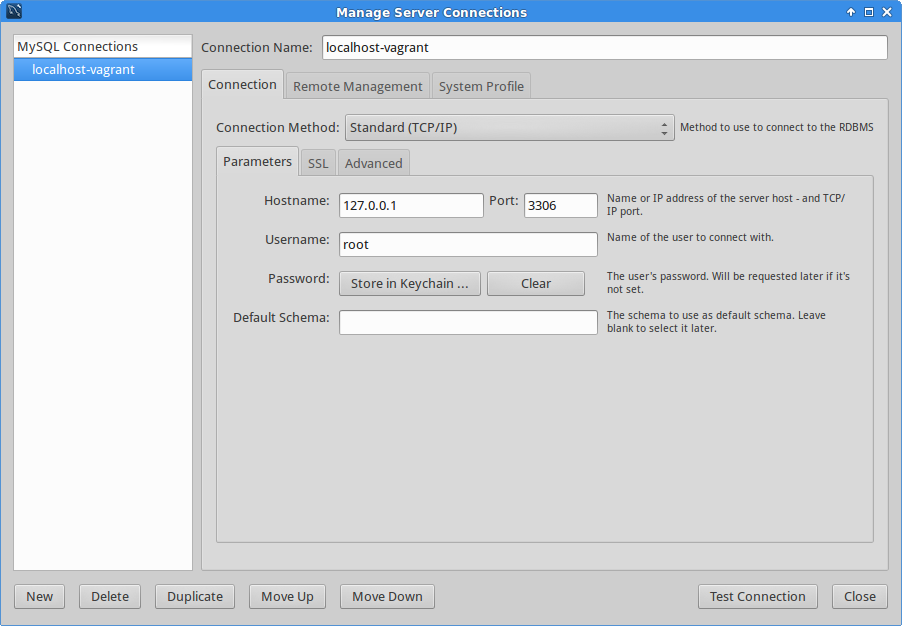

# mysql-vagrant

mysql-vagrant is a quick way to run mysql locally, using dropbox, for development without an ssh tunnel

### Start server

     $ vagrant up

### Notes
* Single command to get started, just clone the repository, navigate to the folder, and type 'vagrant up'
* Easy to connect from the host using the MySQL client of your choice, just open the client and connect to localhost or 127.0.0.1 after starting the server

### Connect to mysql:

- host: localhost
- username: root
- password: root

### From MySQL Workbench

### Warning

For development use only, do not use in production.

### License

MIT
